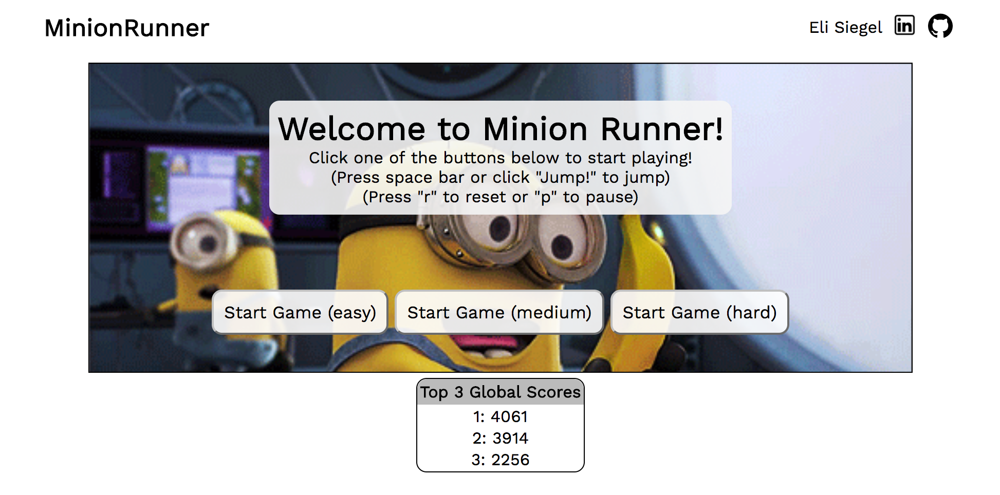

## Minion Runner

[Play here](http://elicsiegel.com/MinionRunner/)



### Background

Minion Runner is an infinite run game, similar to Google's T-Rex runner. It was written in JavaScript and uses Canvas for 2D rendering.

### Description

You, a minion, have just seen a truck full of bananas pass by and can't miss this opportunity to get a tasty snack!

### How to Play

Choose a level of difficulty and start to play. Avoid hitting various obstacles by hitting `SPACE`. Press `p` to pause the game and `r` to restart the game once the game is over. Click on the screen to mute all gameplay audio. 

### Features

#### 2D Rendering & Collision Detection
All 2D rendering is done using HTML 5 Canvas. To detect collisions between the Minion and obstacles, I used a simple algorithm to detect if their dimensions come into contact. 

```javascript
isCollidedWith(otherObject) {
    if (this.position[0] < (otherObject.position[0] + otherObject.width) && 
      (this.position[0] + this.width) > otherObject.position[0] &&
      this.position[1] < (otherObject.position[1] + otherObject.height) &&
      (this.position[1] + this.height) > otherObject.position[1]
      ) { 
      return true;
    } else {
      return false; 
    }
  }
```

#### Scoring

A global leaderboard storing the top three global scores is stored using Firebase. The main functionality of this database can be found in `./lib/database.js`.

#### Audio

All audio playing is done using JavaScript's HTMLAudioElement API.

I implemented an event listener using the native JavaScript API to toggle muting for all Audio elements in the document.

```javascript
setEventListeners() {
    this.canvas.addEventListener('click', (e) => this.mute(e));
  }
```