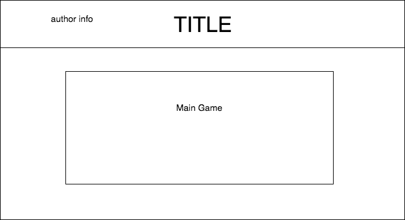

## JS Project Proposal: Minion Runner

### Background

Minion Runner is an infinite run game similar to Google's T-Rex runner. 

### Description

You, a minion, have just seen a truck full of bananas pass by and can't miss this opportunity to get a tasty snack!

### Functionality & MVP  

With Minion Runner, users will be able to:

- [ ] Start, pause, and reset the game 
- [ ] Choose a difficulty level that changes the speed and types of obstacles
- [ ] Scores and saves high scores locally (possibly to a database if there's time)
- [ ] An About modal describing the background and rules of the game
- [ ] A production README

### Wireframes

This app will consist of a single screen with game board, game controls, and nav links to the Github, my LinkedIn, and the About modal.  Game controls will include Start, Stop, and Reset. 

### Architecture and Technologies

This project will be implemented with the following technologies:

- `Vanilla JavaScript` for game logic,
- `HTML5 Canvas` for rendering,
- `Webpack` to bundle js files.

In addition to the entry file, there will be several main scripts involved in this project:

`game.js`: this script will handle the logic for game functionality. 

`minion.js`: this script will handle the logic for minion jumping and collisions.

`obstacle.js`: this script will handle the logic for the obstacles. There will be two sub obstacles, skyscrapers that the minion must jump over and airplanes flying above that the player must not hit. 

`board.js`: this script will handle object rendering on the board.

`difficulty.js`: provides settings for different levels of difficulty

### Implementation Timeline

**Day 1**: Setup basic file structure including webpack and the bare bones of all scripts outlined above. Write a basic entry file and all HTML and CSS that is outside the game board. Start working on Game and Minion script. 

**Day 2**: Finish out the minion script to provide basic jump functionality. Start two different obstacles, skyscraper and airplane. Add collisions between player and these obstacles. 

**Day 3**: Finish out script functionality and add scoring. 

### Bonus features

Possible updates are:

- [ ] Add another type of obstacle
- [ ] Add background music